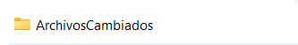
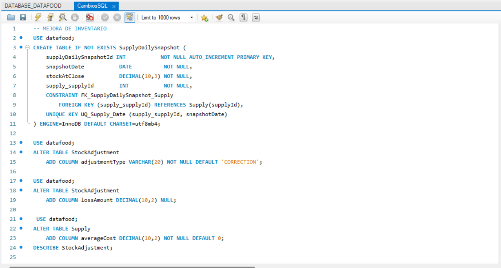
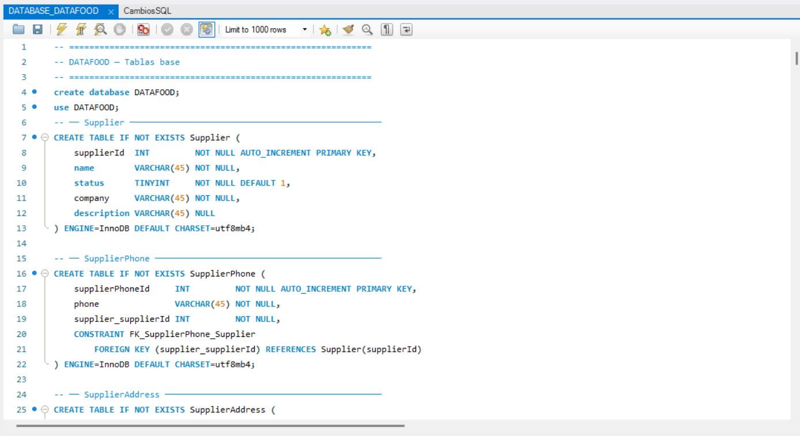
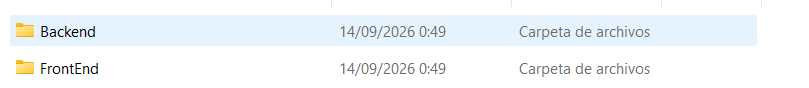

# DATAFOOD_2.0
Mejoras de Inventario y Costeo de recetas

### Paso 1: Localizar los archivos 
Abre la carpeta llamada **ArchivosCambiados**, donde se encuentran todas las modificaciones.

### Paso 2: Actualizar la base de datos
Abre MySQL y ejecuta paso a paso el script SQL llamado **CambiosSQL**.

*Nota: Si la ejecución del archivo anterior presenta errores o no funciona, ejecuta paso a paso el archivo base* **DATABASE_DATAFOOD**

### Paso 3: Sustituir el código
Agregar y sustituir los archivos al proyecto utilizando el contenido de las carpetas **Backend**  y **FrontEnd** . Copia el contenido y reemplaza los archivos.

